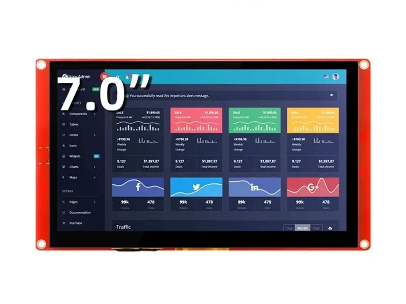

> **Project Status: Active**
>
> This project is actively maintained. Current priorities and planned work are documented below or in GitHub Issues.

# CrowPanel 7.0" ESP32-S3 HMI Display Performance Template

[Türkçe](#türkçe) | [English](#english)

---

<a name="türkçe"></a>
## 🇹🇷 Türkçe

Bu proje, **CrowPanel 7.0 inç (ESP32-S3)** tabanlı endüstriyel ekranlar için optimize edilmiş, yüksek performanslı bir HMI (İnsan-Makine Arayüzü) şablonudur. Proje, özellikle düşük gecikmeli görüntü aktarımı ve modern bir kullanıcı arayüzü (LVGL 8.x) sunmak amacıyla tasarlanmıştır.

---

### 🖼️ Donanım Görseli


---

### 🚀 Öne Çıkan Özellikler

- **Yüksek Performanslı Görüntü Aktarımı:** USB-Serial üzerinden **2 Mbps** hızında, JPEG kodlanmış karelerin (480x320) gerçek zamanlı akışı.
- **Modern Arayüz:** LVGL 8.x kütüphanesi kullanılarak tasarlanmış, karanlık tema destekli kart (Card) yapısı.
- **Düşük Gecikme:** PSRAM (OPI) üzerinden doğrudan dekoder ve DMA destekli ekran yenileme.
- **Gelişmiş Donanım Kontrolü:** Odaklama (Autofocus), çekilen fotoğrafların galeriden izlenmesi ve sistem metrikleri takibi.
- **Modüler Yapı:** Kolayca özelleştirilebilir `ui.h` ve `gfx_conf.h` dosyaları.

---

### 📁 Proje Yapısı

| Klasör / Dosya | Açıklama |
|----------------|----------|
| `main.ino` | Ana kontrol akışı, seri haberleşme protokolü ve JPEG dekoder yönetimi. |
| `ui.h` | LVGL arayüz bileşenleri, stil tanımlamaları ve ekranlar arası geçişler. |
| `gfx_conf.h` | CrowPanel 7.0" (ST7701) için pin tanımlaları ve LovyanGFX konfigürasyonu. |
| `libraries/` | Bağımlı kütüphaneler (LVGL, LovyanGFX, GT911 Touch). |
| `ilablogo.c` | UI üzerinde yer alan kurumsal logo verisi (isteğe bağlı değiştirilebilir). |

---

### ⚙️ Gereksinimler & Kurulum

#### 1. Gerekli Yazılımlar

- Arduino IDE veya PlatformIO
- **ESP32 Board eklentisi sürüm 2.0.8**
  - File > Preferences > Additional boards manager URLs kısmına şu URL'yi ekle:
    `https://espressif.github.io/arduino-esp32/package_esp32_index.json`
  - Ardından Board Manager'dan **esp32 by Espressif Systems** sürüm **2.0.8**'i indir.
- Aşağıdaki kütüphaneler (Arduino IDE kullanıyorsan):
  - LovyanGFX
  - lvgl
  - PCA9557

#### 2. Kütüphane Kurulumu
`libraries` klasörü içerisindeki kütüphaneleri Arduino `libraries` klasörünüze kopyalayın.

#### 3. Kodun Yüklenmesi

Projeyi klonla:
```bash
git clone https://github.com/Metrohan/CrowPanel7.0inchESPHMIDisplay.git
```

- Arduino IDE ile `main.ino` dosyasını aç.
- **Board:** `ESP32S3 Dev Module`
- **USB CDC On Boot:** `Enabled`
- **Flash Mode:** `QIO 80MHz`
- **Partition Scheme:** `Huge APP (3MB No OTA/1MB SPIFFS)`
- **PSRAM:** `OPI PSRAM` (ÇOK ÖNEMLİ)
- Kodu karta yükle; yükleme gerçekleşmezse IDE'yi kapatıp tekrar aç.

> **Not:** Baud ayarını koddaki değerle aynı yapmayı unutma. Dokunmatik ekran çalışmıyorsa Serial Monitor'de `Dokunmatik algılandı` mesajını kontrol et. Mesajı göremiyorsan I2C Scanner ile I2C adresini tespit et ve `gfx_conf.h` içindeki `cfg.i2c_addr = 0x14;` satırını güncelle.

---

### 🤝 İş Birliği
Bu proje, **i-Lab** ile hazırlanmıştır. Daha fazla bilgi ve iletişim için:

🌐 **Web sitesi:** [pieilab.com](http://www.pieilab.com)  
🔗 **LinkedIn:** [PIE i-Lab](https://www.linkedin.com/company/pielabb)

---

### 👨‍💻 İletişim
**Metehan Günen** - [metehangnn@outlook.com](mailto:metehangnn@outlook.com)

---

<br>
<hr>
<br>

<a name="english"></a>
## 🇺🇸 English

This project is a high-performance HMI (Human-Machine Interface) template optimized for **CrowPanel 7.0 inch (ESP32-S3)** based industrial displays. It is designed to provide low-latency image streaming and a modern user interface (LVGL 8.x).

---

### 🖼️ Hardware Visual


---

### 🚀 Key Features

- **High-Performance Image Streaming:** Real-time 480x320 JPEG streaming at **2 Mbps** via USB-Serial.
- **Modern UI:** Card-based design with dark theme support using the LVGL 8.x library.
- **Low Latency:** Direct decoding via PSRAM (OPI) and DMA-supported display refresh.
- **Advanced Hardware Control:** Autofocus adjustment, gallery view for captured images, and real-time system metrics tracking.
- **Modular Design:** Easily customizable `ui.h` and `gfx_conf.h` files.

---

### 📁 Project Structure

| Folder / File | Description |
|----------------|----------|
| `main.ino` | Main control flow, serial communication protocol, and JPEG decoder management. |
| `ui.h` | LVGL interface components, style definitions, and screen transitions. |
| `gfx_conf.h` | Pin definitions and LovyanGFX configuration for CrowPanel 7.0" (ST7701). |
| `libraries/` | Dependent libraries (LVGL, LovyanGFX, GT911 Touch). |
| `ilablogo.c` | Corporate logo data used in the UI (optional and replaceable). |

---

### ⚙️ Requirements & Setup

#### 1. Required Software

- Arduino IDE or PlatformIO
- **ESP32 Board package version 2.0.8**
  - Go to File > Preferences > Additional boards manager URLs and add:
    `https://espressif.github.io/arduino-esp32/package_esp32_index.json`
  - Then install **esp32 by Espressif Systems** version **2.0.8** from the Board Manager.
- The following libraries (if using Arduino IDE):
  - LovyanGFX
  - lvgl
  - PCA9557

#### 2. Library Installation
Copy the libraries inside the `libraries` folder to your Arduino `libraries` directory.

#### 3. Uploading the Code

Clone the project:
```bash
git clone https://github.com/Metrohan/CrowPanel7.0inchESPHMIDisplay.git
```

- Open `main.ino` with Arduino IDE.
- **Board:** `ESP32S3 Dev Module`
- **USB CDC On Boot:** `Enabled`
- **Flash Mode:** `QIO 80MHz`
- **Partition Scheme:** `Huge APP (3MB No OTA/1MB SPIFFS)`
- **PSRAM:** `OPI PSRAM` (CRITICAL: Required for image processing)
- Upload the code; if it fails, close and reopen the IDE.

> **Note:** Make sure the baud rate matches the value in the code. If the touchscreen is not working, check the Serial Monitor for the touch detection message. If not detected, use an I2C Scanner to find the correct address and update `cfg.i2c_addr = 0x14;` in `gfx_conf.h`.

---

### 🤝 Collaboration
This project was prepared with **i-Lab**. For more information and contact:

🌐 **Website:** [pieilab.com](http://www.pieilab.com)  
🔗 **LinkedIn:** [PIE i-Lab](https://www.linkedin.com/company/pielabb)

---

### 👨‍💻 Contact
**Metehan Günen** - [metehangnn@outlook.com](mailto:metehangnn@outlook.com)

---
*This project was created to push the limits of the CrowPanel 7.0" display and provide developers with a ready-to-use HMI skeleton.*